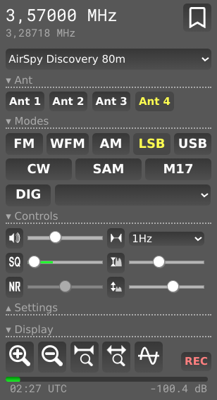

# OpenWebRX+ Antenna Switcher Plugin

This plugin for OpenWebRX+ allows you to switch antenna ports by adding buttons to the UI and sending requests directly to a "remote antenna switch" (an ESP8266-based microcontroller, such as a Wemos D1) to perform the actual coax switching. the Project can be found here: https://github.com/mnoalett/remote-antenna-switch

## Changes Made

- Reduced the number of buttons from 4 to 2 to align with the base Remote Antenna Switch project. The number of buttons can be increased if needed.
- Adapted the code so that instead of sending a request to a WebAPI server on port 5001, it directly sends requests to the "remote antenna switch" (ESP8266-based, Wemos D1) using its API to control the antenna switching.
- **Important**: The apiEndpoint variable in the code must be updated to match the IP address or mDNS hostname of the remote antenna switch for proper operation.

## Original Description

Plugin for OpenWebRX+ to switch antenna ports by adding some buttons to the UI and using a WebAPI on the server to do the actual coax switching.

In https://groups.io/g/openwebrx/topic/103251000 support for javascript plugins for OpenWebRX+ was announced.
I used the given information to build this ugly but working piece of code.

Beware: I don't really know a lot about javascript and how to use it properly (this is my very first attempt),
so please consider the code to be at least buggy or plain broken.

## Overview

This OpenbWebRX+ plugin adds a PanelLine with 4 Buttons to the Client User Interface.
The number of buttons can be adjusted to your needs by editing the .js file.

When hitting one of the buttons, the Plugin sends a request to a WebAPI running on port 5001 on the OpenWebRX server.
The WebAPI server in turn is responsible to do the actual switching. In my case this is done by sending commands to an Arduino to switch a coaxial relay.
To get a working solution you have to provide a WebAPI fitted to your needs and have to adjust the plugin to deal with its API.

The WebAPI returns the active antenna port and the plugin highlights the corresponding button.

You can find the WebAPI I'm using at https://github.com/jrghnng/AntennaSwitcherWebAPI

## Installation

Please check https://groups.io/g/openwebrx/message/9485

If you are absolutely sure about what you are doing (this code is really crappy, see above), put the .js and .css file in the proper plugin directory on your server.
In my case that's /usr/lib/python3/dist-packages/htdocs/plugins/receiver/owrxantswitcher.

Then load the plugin by adding

Plugins.load('owrxantswitcher');

to the init.js file.

In my case the init.js file is located in /usr/lib/python3/dist-packages/htdocs/plugins/receiver.
